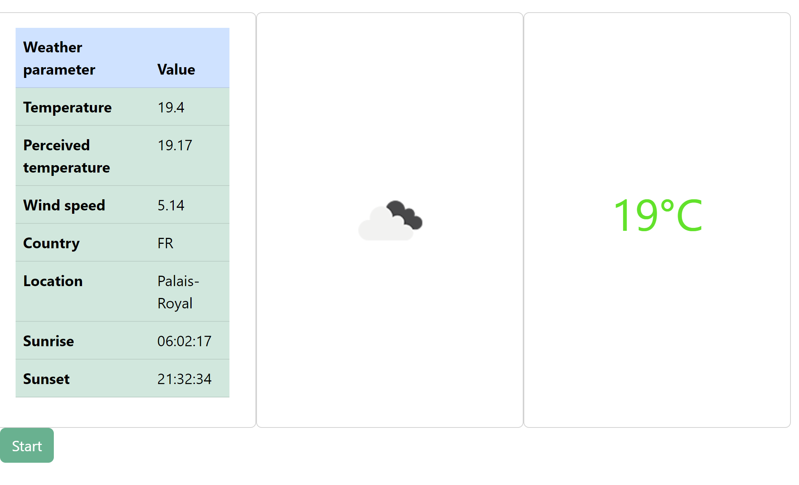
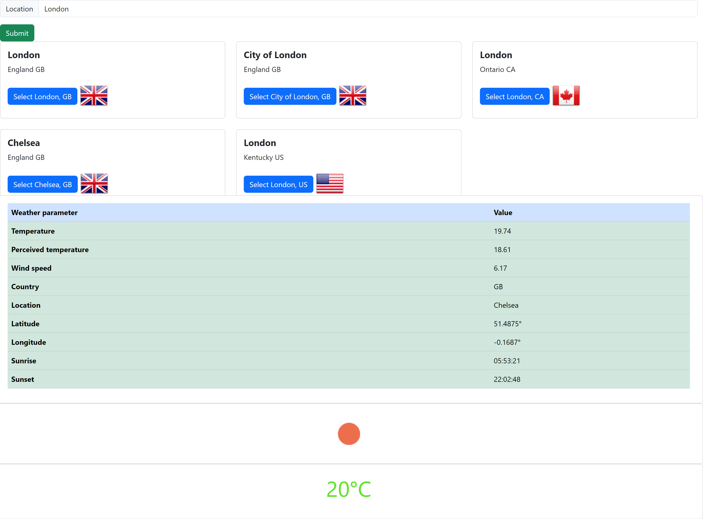

# AJAX and JQuery pages consuming OpenWeather APIs

- This repository showcases OpenWeather API and displays the weather data in a chart.
- In order to run the functions you will an account with OpenWeather https://openweathermap.org/api and you need to use your personal API key in the web service URLs.
- The project consists of two parts: WeatherAjax and WeatherAjaxForecast.

## WeatherAjax.js
- The WeatherAjax.js retrives weather parameters such as the temperature and the wind speed in the given city and populates a table with those values to be displayed after clicking the start button.

## Updated layout

## City look up API functionality

- The user types in the city name they want to look up in the textbox and clicks the "Submit" button. It triggers an API call which returns an object with parameters for the city provided.
- The user selects one of the cities returned and clicks a button to display the weather parameters in a given city.
- The API call returns the parameters which are inserted into a table.
- Once the table is complete, the icon representing the weather pops up and the rounded temperature value smoothly fades in.

## WeatherAjaxForecast.js

- The WeatherAjaxForecast retrives the temperature data collected every three hours in a given city. The temperature data is then assigned to the variables used by the Chart.js library in order to display them on a line chart. 

## Future features
- A dropdown list with the city names to retrive the weather parameters from.
- A seperate API call to retrieve the weather parameters based on input city.
- A functionality that enables the user to retrieve the weather parameter table based on city selected from the API response array.
- A smooth scrolling feature with jQuery/JavaScript for improved UX.
- Bootstrap enhanced layout.
- Connecting the city look up feature with the chart feature.

